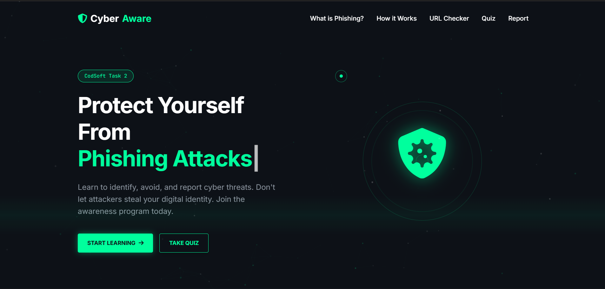
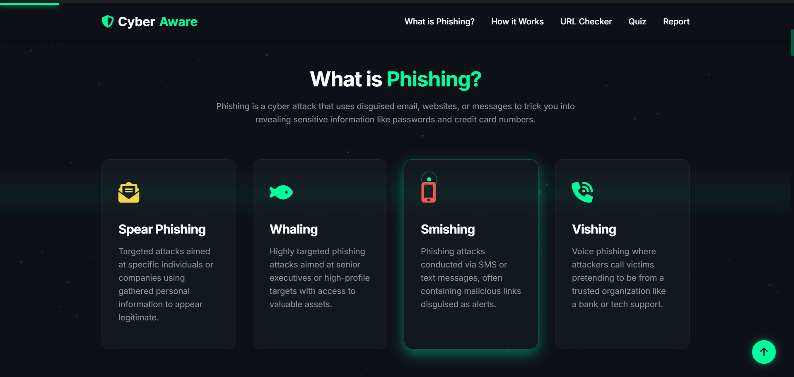
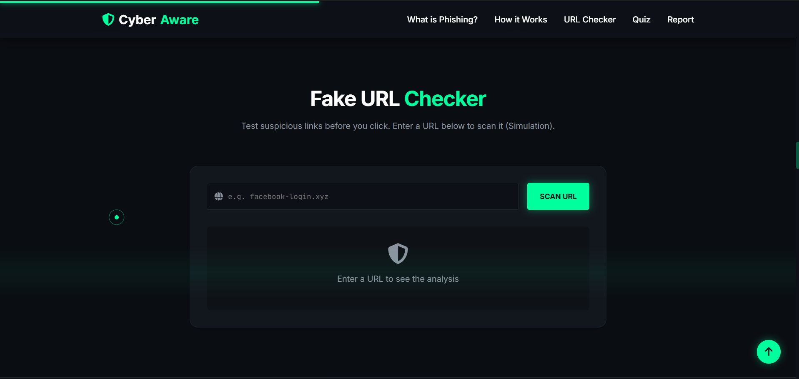
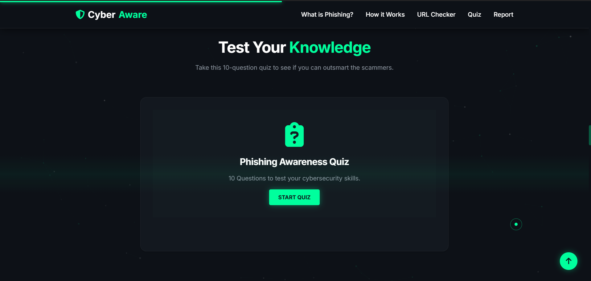
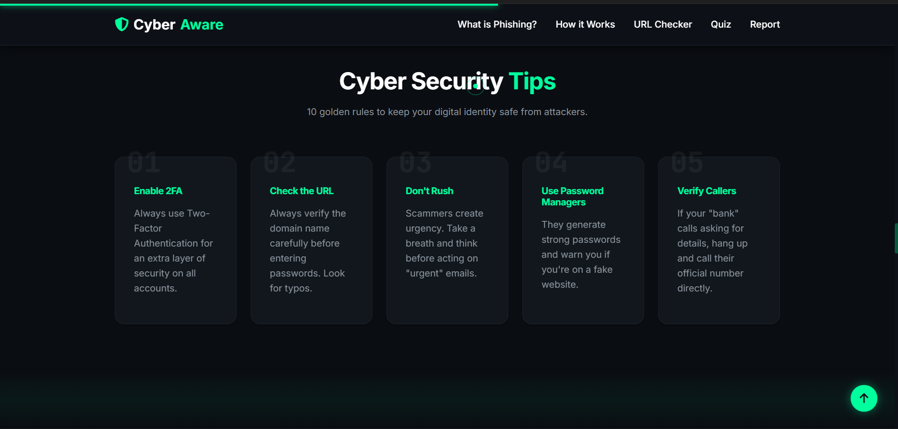
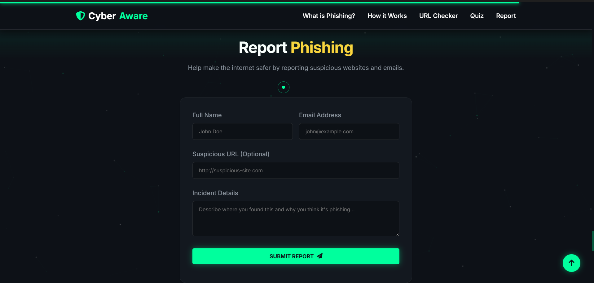

# 🛡️ Phishing Awareness Program

> An interactive Cyber Security Awareness Platform developed as **Task 2** for the **CodSoft Cyber Security Internship**.


---

# 📌 Project Overview

Phishing attacks are one of the most common cyber threats that target individuals and organizations by stealing sensitive information such as usernames, passwords, banking details, and personal data.

This project is an interactive web-based learning platform designed to educate users about phishing attacks through real-life examples, simulations, quizzes, and cyber security best practices.

Instead of being a simple informational website, this platform provides an engaging learning experience that helps users recognize and avoid phishing attempts.

---

# 🎯 Objectives

- Educate users about phishing attacks
- Explain different phishing techniques
- Demonstrate fake vs genuine emails
- Simulate URL safety checking
- Test users' knowledge through quizzes
- Promote safe online practices

---

# ✨ Features

✅ Modern Cyber Security UI

✅ Fully Responsive Design

✅ Dark Hacker Theme

✅ Interactive Navigation

✅ What is Phishing Section

✅ Types of Phishing

✅ Attack Flow Visualization

✅ Fake vs Genuine Email Comparison

✅ URL Checker Simulation

✅ Interactive Quiz

✅ Security Tips

✅ Real-Life Phishing Case Studies

✅ Report Phishing Form

✅ FAQ Section

✅ Smooth Animations

✅ Scroll Progress Indicator

✅ Mobile Friendly

---

# 🛠️ Technologies Used

- HTML5
- CSS3
- JavaScript (ES6)
- Responsive Web Design

---

# 📁 Folder Structure

```text
Task2_Phishing_Awareness/
│
├── index.html
│
├── css/
│   ├── style.css
│   └── responsive.css
│
├── js/
│   ├── script.js
│   ├── quiz.js
│   └── url_checker.js
│
├── images/
│
├── screenshots/
│   ├── home.png
│   ├── phishing_info.png
│   ├── url_checker.png
│   ├── quiz.png
│   └── report_form.png
│
└── README.md
```

---
## Live Demo
Website Link: https://phishing-awarness-s.netlify.app/

---
# 📸 Screenshots

## 🏠 Home Page



---

## 🎣 What is Phishing



---

## 🌐 URL Checker



---

## 🧠 Quiz Section



---

## 🛡️ Security Tips



---

## 📨 Report Phishing



---

# 🎓 Learning Outcomes

Through this project, I learned:

- Cyber Security Awareness
- Phishing Attack Identification
- Responsive Web Development
- HTML5 Best Practices
- CSS Animations
- JavaScript DOM Manipulation
- UI/UX Design
- Git & GitHub

---

# 🔒 Future Improvements

- AI-based Phishing Detection
- Real URL Reputation API
- Email Scanner
- Dark/Light Theme Toggle
- User Login System
- Progress Tracking
- Certificate Generation
- Multi-language Support

---

# 👨‍💻 Developer

**Saurabh Prasad Gupta**

Computer Science & Engineering Student

CodSoft Cyber Security Internship

---

# 📄 Internship Details

**Internship:** CodSoft Cyber Security Internship

**Task:** Task 2

**Project:** Phishing Awareness Program

---

# ⭐ Support

If you found this project useful, consider giving it a ⭐ on GitHub.

---

# 📜 License

This project is developed for educational purposes as part of the **CodSoft Cyber Security Internship**.

MIT License

---

## 💙 Thank You

Thank you for visiting this repository.

Stay Safe.

Stay Secure.

🛡️ Happy Learning!
