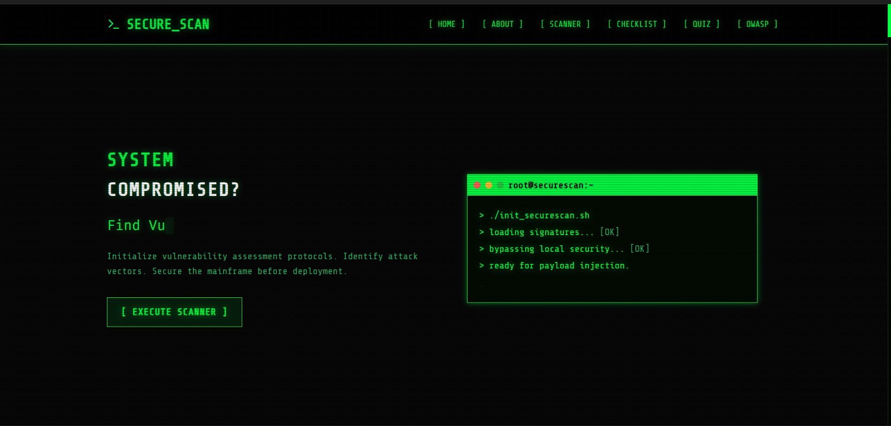
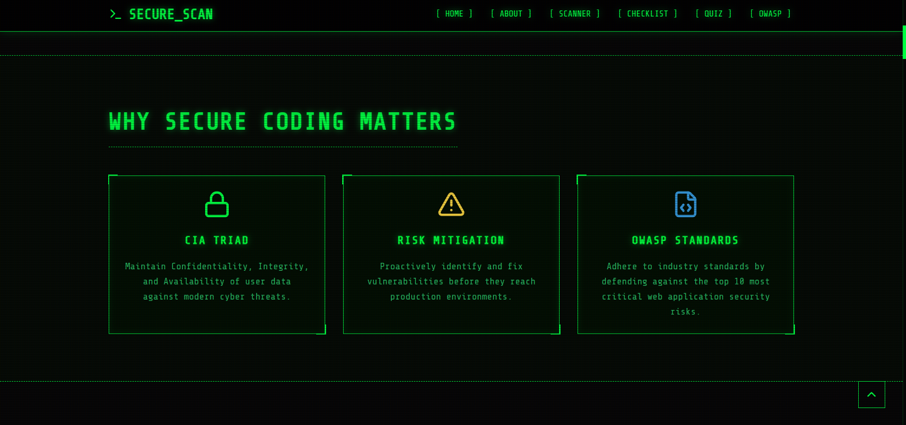
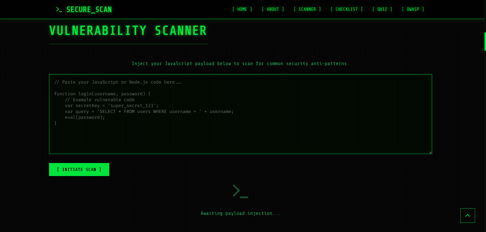
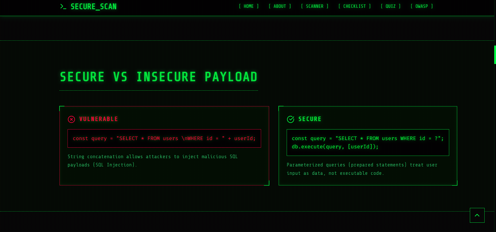
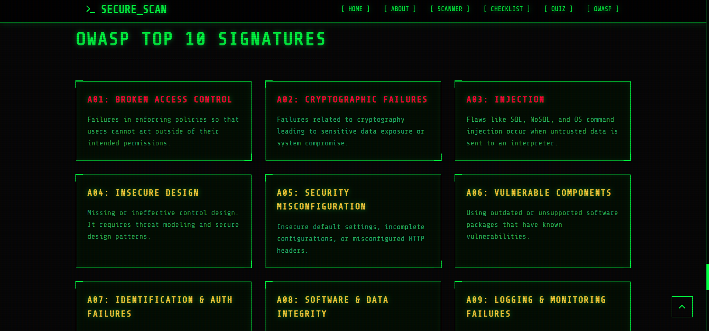
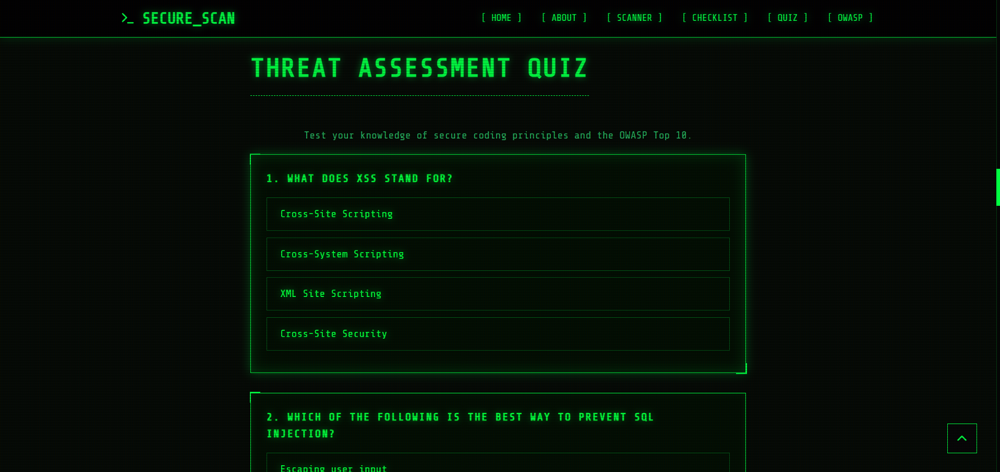

# 🛡️ Secure Scan - Secure Code Review & Vulnerability Assessment Tool

> A professional web-based Secure Code Review and Vulnerability Assessment platform developed as **Task 3** for the **CodSoft Cyber Security Internship**.


---

# 📌 Project Overview

Secure Scan is an interactive cyber security platform designed to educate developers about secure coding practices and common software vulnerabilities.

The application allows users to analyze sample JavaScript code for common security weaknesses, understand OWASP Top 10 vulnerabilities, compare secure and insecure coding techniques, and test their cyber security knowledge through an interactive quiz.

This project was developed as part of the **CodSoft Cyber Security Internship**.

---

# 🎯 Objectives

- Promote secure coding practices
- Demonstrate common software vulnerabilities
- Explain OWASP Top 10
- Identify insecure coding patterns
- Improve cyber security awareness among developers
- Provide hands-on learning through code scanning

---

# ✨ Features

✅ Modern Hacker Style Interface

✅ Secure Code Scanner

✅ Rule-Based Vulnerability Detection

✅ Secure vs Insecure Code Comparison

✅ OWASP Top 10 Guide

✅ Interactive Security Checklist

✅ Cyber Security Quiz

✅ Smooth Animations

✅ Responsive Design

✅ Dark Cyber Theme

---

# 🛠️ Technologies Used

- HTML5
- CSS3
- JavaScript (ES6)
- Responsive Web Design

---

# 📂 Folder Structure

```text
CODSOFT_TASK3/

│

├── index.html

├── css/
│      style.css
│      responsive.css

├── js/
│      script.js
│      scanner.js
│      quiz.js
│      report.js

├── screenshots/
│      home.png
│      secure_coding.png
│      scanner.png
│      secure_vs_insecure.png
│      owasp_top10.png
│      quiz.png
│      report.png

└── README.md
```

---

# 🚀 How to Run

1. Clone the repository

```
git clone <repository-link>
```

2. Open the project folder

3. Launch **index.html**

OR

Run using **VS Code Live Server**

---

# 📸 Project Screenshots

## 🏠 Home Page

Professional cyber security landing page.



---

## 🔐 Why Secure Coding Matters

Learn the importance of secure software development.



---

## 🔍 Vulnerability Scanner

Analyze JavaScript code and identify common security vulnerabilities.



---

## ⚖ Secure vs Insecure Code

Compare vulnerable code with secure coding practices.



---

## 🛡️ OWASP Top 10

Learn the most critical web application security risks.



---

## 🧠 Security Quiz

Interactive quiz to test secure coding knowledge.



---

# 📚 Learning Outcomes

During this project I learned:

- Secure Coding Principles
- OWASP Top 10
- Vulnerability Assessment
- Rule-Based Code Analysis
- JavaScript DOM Manipulation
- Responsive Web Design
- Git & GitHub
- Cyber Security Best Practices

---

# 🔒 Future Improvements

- AI-Powered Vulnerability Detection
- Multi-language Code Scanner
- PDF Security Report Export
- Syntax Highlighting
- User Authentication
- Cloud-based Code Analysis
- Real-time Threat Intelligence

---

# 👨‍💻 Developer

**Saurabh Prasad Gupta**

Computer Science & Engineering Student

CodSoft Cyber Security Internship

---

# 📄 Internship Details

**Internship:** CodSoft Cyber Security Internship

**Task:** Task 3

**Project:** Secure Code Review & Vulnerability Assessment Tool

---

# ⭐ Support

If you found this project useful, please consider giving it a ⭐ on GitHub.

---

# 📜 License

This project was developed for educational purposes as part of the CodSoft Cyber Security Internship.

MIT License.

---

# 💚 Thank You

Stay Secure.

Code Securely.

Keep Learning.

🛡️ Happy Coding!